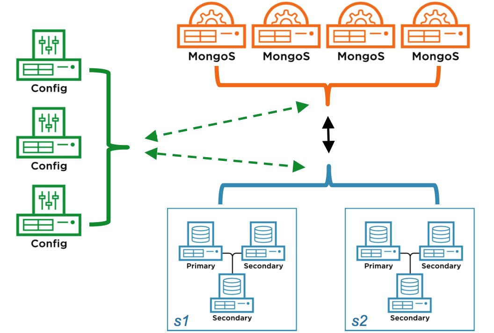

# GridFS,Aggregation,Replication,Sharding

## GridFS

In MongoDB, use GridFS for storing files larger than 16 MB.


when to use GridFS
```
If your filesystem limits the number of files in a directory, you can use GridFS to store as many files as needed.

2  partial retrieval
When you want to access information from portions of large files without having to load whole files into memory, you can use GridFS to recall sections of files without reading the entire file into memory.

3 geographically distributed replica sets
When you want to keep your files and metadata automatically synced and deployed across a number of systems and facilities, you can use GridFS. When using geographically distributed replica sets, MongoDB can distribute files and their metadata automatically to a number of mongod instances and facilities.
```

files and chunks
```
fs.files: meta data

fs.chunks: real data
```


## how gridFS works


```
a bucket is nothing but a namespace

GridFS is a specification for storing and retrieving files that exceed the BSON-document size limit of 16 MB.

```

```sh
1 in side mongoDB, add a GridFS bucket    

2   

```

////////////

option1:
```
use nosql Booster to upload files to gridfs
```

option2:  // mongofiles cmd doesn't have the option   
```sh
mongofiles <options> <commands> <filename>

mongofiles -d DB_GRIDFS_ONE_DEMO put sampleDb.json   # automatically upload the file to a default bucket called fs.files

mongofiles -d DB_GRIDFS_ONE_DEMO list

```

The default size is 255 kilobytes (kB). Please visit the MongoDB documentation page - GRIDFS for more Info https://docs.mongodb.com/manual/core/gridfs/


Mongofiles command can be used to Put,Get,Delete,Search a file against a MongoDB database.Is this true?


GridStream.js example
```
https://gist.github.com/psi-4ward/7099001
```

////////////////////////////////////////////////////////////////////////////////////////////////
Aggregation 

3 types of aggregation

```
$group
$match
$limit
$skip
$project
$sum
$avg

```

3 types of aggregation
```
Aggregation pipeline
MapReuce
Single Purpose Aggregation Operations
```

pipeline example
```json
db.orders.aggregate([
	{$match: {status: "A"}},
	{$group: {_id: "$cust_id", total: {$sum: "$amount"}}}
])
```

mapReduce example # first query, then map, then reduce
```json
db.orders.mapReduce(
	    function() { emit(this.cust_id, this.amount);},
	    function(key, values) {return Array.sum(values)},
	    {
	    	query: {status: "A"},
	    	out: "order_totals"
	    }
	)

```


single purpose aggregation operations
```json

db.collection.count()
db.collection.group()
db.collection.distinct()


```

```
db.webrank.insert({site: 'google.com', visits:432432, category:'search'})

db.webrank.insert({site: 'google1.com', visits:432432, category:'search1'})

db.webrank.insert({site: 'google2.com', visits:432432, category:'search2'})

db.webrank.insert({site: 'google3.com', visits:432432, category:'search3'})

db.webrank.insert({site: 'google1.com', visits:432432, category:'search1'})

db.webrank.insert({site: 'google2.com', visits:432432, category:'search2'})

db.webrank.insert({site: 'google3.com', visits:432432, category:'search3'})

```


```sh
db.webrank.distinct("site")
# [ "google.com", "google1.com", "google2.com", "google3.com" ]

db.webrank.count()
# 7

db.webrank.count({category:'search1'})
# 2

db.webrank.distinct("category")
# [ "search", "search1", "search2", "search3" ]

```

////////////////////////////////////////////////////////////////////////////////////////////////
Aggregation pipeline  

```sh
db.collection.aggregation(pipeline, options)
```

```
$project
$match
$limit
$skip
$group

```


!! group example
```sh
db.webrank.find()  

db.webrank.aggregate({
	$group: {_id:"$category", totalnumber:{$sum:1}}
})  

```

sort example
```sh
db.webrank.find()  

db.webrank.aggregate({
	$group: {_id:"$category", totalnumber:{$sum:1}}
}, {
	$sort: {totalnumber:-1}
}
)  

{ "_id" : "search3", "totalnumber" : 2 }
{ "_id" : "search1", "totalnumber" : 2 }
{ "_id" : "search2", "totalnumber" : 2 }
{ "_id" : "search", "totalnumber" : 1 }
```

avg example
```sh
db.webrank.find()  

db.webrank.aggregate({
	$group: {_id:"$category", avgvisits:{$avg:'$visits'}}
}, {
	$sort: {avgvisits: -1}
}
)  

```


```
db.webrank.find({category:'search1'}).count();
```


```
$group
$match
$sort
$limit

```


Data processing pipelines - Aggregation pipelines using Satge operators such as $match,$project are recommended. 

There are around 20+ stage operators like $out, $lookup, $limit, $project in Aggregation pipeline. Is this True?
Yes, Almost 10 of them are very useful such as $project,$match,$limit,$sort,$skip,$out,$addFields,$count,$sample,$unwind For more precise info visit 


$match, $limit, and $skip stages are recommended to use in the earlier stage of the pipeline, as they can filter out unwanted documents.

$project  operator  will output one document for each input document.Its used for adding or removing fields .
$project operator as the name indicates its for projection. More info @ https://docs.mongodb.com/manual/reference/operator/aggregation-pipeline/

$addFields is a Staging operator and  can be used to add new fields to documents.So the resulting documents will have old and new Fields added


True
Aggregation pipeline stages have maximum memory use limit. For eg) The $sort stage has a limit of 100 megabytes of RAM. 
By default, if the stage exceeds this limit, $sort will produce an error. 
To allow for the handling of large datasets, set the allowDiskUse option to true

////////////////////////////////////////////////////////////////////////////////////////////////
Aggregation pipeline - continue


```sh
db.webrank.aggregate({
	$group: {_id:"$category", avgvisits:{$avg:'$visits'}}
}, {
	$sort: {avgvisits: -1}
}, {
	$limit: 3
}
)  
```

skip
```sh
db.webrank.aggregate({
	$group: {_id:"$category", avgvisits:{$avg:'$visits'}}
}, {
	$sort: {avgvisits: -1}
}, {
	$skip: 1
}
)  
```

match --- use match as early as possible(it will filter the documents)
```sh
db.webrank.aggregate({
	$match: {category:'search1'}
}, {
	$sort: {visits: -1}
}, {
	$limit: 2
}
)  
```


!!! match --- use match as early as possible(it will filter the documents)
```sh
db.webrank.aggregate(
   {	$group: {_id:'$category', totalvisits:{$sum:'$visits'}
}}, {
	$match: {totalvisits: {$gte:1000*20}}
}
)  
```

project
```sh
# list all
db.webrank.aggregate()

db.webrank.aggregate([{$project: {site:1, visits:1}}])

db.webrank.aggregate([{$project: {_id:0, site:1, visits:1}}])

db.webrank.aggregate([{$project: {_id:0, visits:1, site:{$substr:["$site", 0, 4]}}}])

db.webrank.aggregate(
	{$group:{_id:'$category', totoalvisits:{$sum: '$visits'}}},
	{$match:{totalvisits:{$gte:1000*2}}}
)

db.webrank.aggregate([
	{$group: {_id: "$category", averagevisits: {$avg: '$visits'}}}
])

#find top category
db.webrank.aggregate([
	{$group:{
		_id: {category: "$category"},
		visits: {$sum: "$visits"}
	  }
	},
	{$sort: {visits: -1}},
	{$limit:2}
	
])

db.webrank.aggregate([
	{$project: {site:1, visits:1, category:1, _id: 0}},
	{$sort: {category:1, visits:-1}}	
])


```


assignment1
```sh
Questions for this Assignment
Use the Sample Restaurant JSON file provided by MongoDB .

https://docs.mongodb.com/getting-started/shell/import-data/

Using Aggregation pipeline ,find the average score of every restaurant.
```

**unwind follows an array**

answer
```sh
$avg is available in the $group and $project stages.


db.restaurants.aggregate(
	{$unwind:  "$grades" },
	{$group: {
		 _id: "$name",
		 avgScore: {$avg: "$grades.score"}
	   }
	}
).forEach(function(f){print(tojson(f, '', true));});
```


assignment2
```sh
db.restaurants.aggregate({$sum, grades.score})

Use the Sample Restaurant JSON file provided by MongoDB .

https://docs.mongodb.com/getting-started/shell/import-data/

Using Aggregation pipeline find the top 10 restaurants with Good scores
```

answer
```sh
$avg is available in the $group and $project stages.


db.restaurants.aggregate(
	{$unwind:  "$grades" },
	{$group: {
		 _id: "$name",
		 avgScore: {$avg: "$grades.score"}
	   }
	},
	{$sort: {avgScore: -1}},
	{$limit: 10}
).forEach(function(f){print(tojson(f, '', true));});
```

assignment3
```sh
Use the Sample Restaurant JSON file provided by MongoDB .

https://docs.mongodb.com/getting-started/shell/import-data/

Using Aggregation pipeline find the top 5 zipcodes of restaurants with good scores
```

answer
```sh
db.restaurants.aggregate(
	{$unwind: "$grades"},
    {$project: {name:1, grades:1, address: 1}},
	{$group: {
		  _id:"$name",
		  aveScore:{$avg: "$grades.score"},
		  zipcode:{$first: "$address.zipcode"}
	   }
    },
    {$sort: {aveScore:-1}},
    {$limit: 5} 
)
```

assignment4
```
Use the Sample Restaurant JSON file provided by MongoDB .

https://docs.mongodb.com/getting-started/shell/import-data/

Using Queries or Aggregation pipeline get the latest 10 ratings- Scores
```

answer
```sh
db.restaurants.aggregate(
	{$unwind: "$grades"},
	{$group: {
		_id: "$name",
		avgScore: {$avg:"$grades.score"}
	  }
    },
    {$sort: {avgScore: 1}},
    {$limit: 10}
)

```

assignment5
```
Use the Sample Restaurant JSON file provided by MongoDB .

https://docs.mongodb.com/getting-started/shell/import-data/

Using Aggregation pipeline get the top 5 restautants with American Cuisine.
```

answer
```sh
db.restaurants.aggregate(
	{$match: {cuisine: {$eq:"American"} } },
	{$unwind: "$grades"},
	{$group: {
		_id: "$name",
		avgScore: {$avg: "$grades.score"},
		cuisine: {$first: "$cuisine"}}
	},
    {$sort:{avgScore:-1}},
    {$limit:5}
)

```


////////////////////////////////////////////////////////////////////////////////////////////////
sharding




horizental scaling
```
config server -- holding meta data

routers--communicating with the app, redirecting the query to the particular shards

shards-- holding the real data

```


6stepsSharding
```sh
1 create instances of sharding server

2 create config server

3 create query router for the config server

4 using mongos - in the admin database, add sharding instances, databases & collection through router

5 in the quert router, mongos insert data

6 validate the data inserted is distributed among servers

```


true  
``` 
MongoDB supports Horizontal scaling through sharding.
A sharded cluster can continue to perform partial read / write operations even if one or more shards are unavailable 
```

true
```
A database can have a mixture of sharded and unsharded collections.
Sharded collections are partitioned and distributed across the shards in the cluster. 
Unsharded collections are stored on a primary shard. Each database has its own primary shard.

If the above is True? or we cant have both sharded collections and unsharded collections in the same database.
```

true
```
MongoDB partitions the collection using the shard key.

The shard key is an indexed field that exists in every document in the collection.
Please note the word every document. Is this true?
```

true
```
mongos for “MongoDB Shard,” is a routing service for MongoDB shard configurations that processes queries from the application layer, and determines the location of this data in the sharded cluster, in order to complete these operations. From the perspective of the application, a mongos instance behaves identically to any other MongoDB instance.
```

true
```
sh.addShard(host)

Adds a database instance or replica set to a sharded cluster
Is this correct?
```

true
```
shardCollection - command

Shards a collection to distribute its documents across shards. 

We can specify the collection and shard key as a parameter to this command

Is this correct?
```


```
```

4.1

**mongo**
mongo is an interactive JavaScript shell interface to MongoDB, which provides a powerful interface for system administrators as well as a way for developers to test queries and operations directly with the database. 

**mongod**  
mongod is the primary daemon process for the MongoDB system. It handles data requests, manages data access, and performs background management operations.

**mongos**  
mongos for “MongoDB Shard,” is a routing service for MongoDB shard configurations that processes queries from the application layer, and determines the location of this data in the sharded cluster, in order to complete these operations. From the perspective of the application, a mongos instance behaves identically to any other MongoDB instance.


```sh
mongos --help

Sharding options:
  --configdb arg                        Connection string for communicating 
                                        with config servers:
                                        <config replset name>/<host1:port>,<hos
                                        t2:port>,[...]
```

////////////////////////////////////////////////////////////////////////////////////////////////

**replica set**  
A replica set in MongoDB is a group of mongod processes that maintain the same data set. Replica sets provide redundancy and high availability, and are the basis for all production deployments. 

A replica set can have up to 50 members but only 7 voting members.


**primary node**  
The primary node receives all write operations. A replica set can have only one primary capable of confirming writes with { w: "majority" } write concern

**The secondaries**
The secondaries replicate the primary’s oplog and apply the operations to their data sets such that the secondaries’ data sets reflect the primary’s data set. 

**Arbiters**  
You may add an extra mongod instance to a replica set as an arbiter. Arbiters do not maintain a data set. The purpose of an arbiter is to maintain a quorum in a replica set by responding to heartbeat and election requests by other replica set members. Because they do not store a data set, arbiters can be a good way to provide replica set quorum functionality with a cheaper resource cost than a fully functional replica set member with a data set.


```
Replication:
Replica-set: A group of mongod processes that maintain the same data set
Primary: Endpoint for writes
Secondary: Pull and Replicates changes from Primary (oplog)
Election: The process that changes the Primary on a replica-set

Partitioning:
Partition: A logical separation of a data set (may also be physical) on a server
Partition key: A field (or a combination of fields) used to distinct partition

Sharding:
Similar to partitioning with the difference that partitions(chunks) may located on different servers
(shards)

Sharding: A field (or a combination of fields) used to distinct chunks 
```

see scripts/readme.md

also, see  
https://drive.google.com/open?id=1eVszzE3CaaOhWa2NbauGJNcI3nvhV0Ss

////////////////////////////////////////////////////////////////////////////////////////////////

replication

under replication, all nodes have the same data


```sh
docker exec -it dbsetup_mongodb_1 /bin/bash

mongod --port "port" --dbpath "DB DIR PATH" --REPLSET "REPLICA_SET_NAME"  # REPLICA_SET_NAME should be the same
rs.add(HOST:PORT)


------------------------------

mkdir /test
mkdir /test/repl_db1
mkdir /test/repl_db2

mongod --port 27020 --dbpath /test/repl_db1 --replSet repl_one_demo
mongod --port 27021 --dbpath /test/repl_db2 --replSet repl_two_demo

# it seems the following cmd is outdated. 

rs.initiate()

rs.status()

rs.add("localhost:27021");

```


