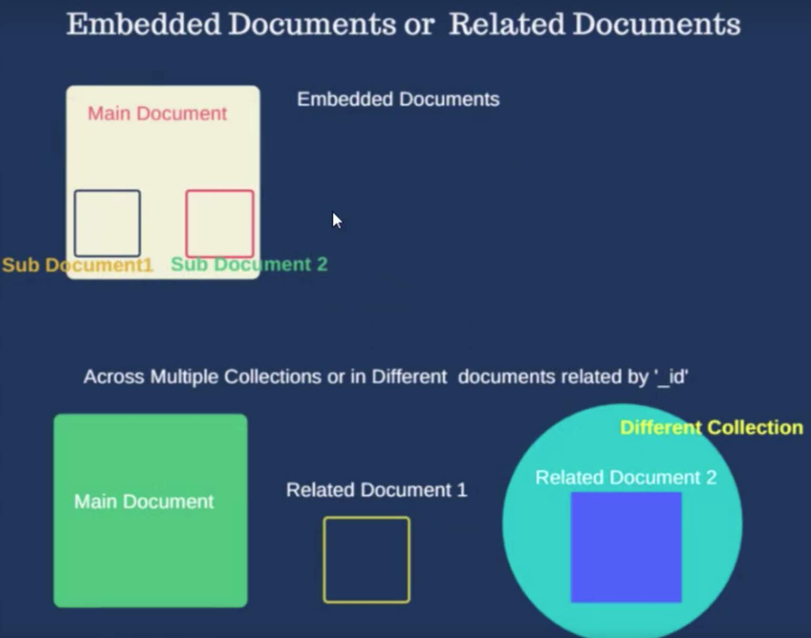

# mapreduce, indexing, regex, embedded docs, capped, TTL, mongoDump

## mapReduce

```
mapReduce 
queries(filters documents) --> map function(maps each documents emits KEY VALUES) --> reduce function(reduces the number of values to aggregated data (eg total_sales))
--> finalize(beautificaitons) --> out(collections)
```

```java
db.collection.mapReduce(
                         <map>,
                         <reduce>,
                         {
                           out: <collection>,
                           query: <document>,
                           sort: <document>,
                           limit: <number>,
                           finalize: <function>,
                           scope: <document>,
                           jsMode: <boolean>,
                           verbose: <boolean>,
                           bypassDocumentValidation: <boolean>
                         }
                       )

```


```js
db.orders.mapReduce(
	function() { emit(this.cust_id, this.amount); },
	function(key, value) {return Array.sum(values)},
	{
		query: {status: "A"},
		out: "order_totals"
	}
)


```

```sh
use testdb
db.sampleCollection.find().pretty();

# the result is like
{
  "_id" : 18,
  "name" : "Verdell Sowinski",
  "scores" : [
    {
      "score" : 62.12870233109035,
      "type" : "exam"
    },
    {
      "score" : 84.74586220889356,
      "type" : "quiz"
    },
    {
      "score" : 81.58947824932574,
      "type" : "homework"
    }
  ]
}

```

```sh
db.sampleCollection.aggregate([{$unwind:"$scores"}])
# the result is like:
{ "_id" : 0, "name" : "aimee Zank", "scores" : { "score" : 1.463179736705023, "type" : "exam" } }
{ "_id" : 0, "name" : "aimee Zank", "scores" : { "score" : 11.78273309957772, "type" : "quiz" } }
{ "_id" : 0, "name" : "aimee Zank", "scores" : { "score" : 35.8740349954354, "type" : "homework" } }
{ "_id" : 1, "name" : "Aurelia Menendez", "scores" : { "score" : 60.06045071030959, "type" : "exam" } }
{ "_id" : 1, "name" : "Aurelia Menendez", "scores" : { "score" : 52.79790691903873, "type" : "quiz" } }
{ "_id" : 1, "name" : "Aurelia Menendez", "scores" : { "score" : 71.76133439165544, "type" : "homework" } }
{ "_id" : 2, "name" : "Corliss Zuk", "scores" : { "score" : 67.03077096065002, "type" : "exam" } }
{ "_id" : 2, "name" : "Corliss Zuk", "scores" : { "score" : 6.301851677835235, "type" : "quiz" } }
{ "_id" : 2, "name" : "Corliss Zuk", "scores" : { "score" : 66.28344683278382, "type" : "homework" } }
{ "_id" : 3, "name" : "Bao Ziglar", "scores" : { "score" : 71.64343899778332, "type" : "exam" } }

// create the map function
var map_function = function() {
  emit(this.name, this.scores.score);
};

// create the reduce function
var reduce_function = function(student_name, total_marks_in) {
  return Array.sum(total_marks_in) / total_marks_in.length;
  
};
// 
db.sampleCollection2.mapReduce(map_function, reduce_function, {out:'result_map_reduce'})

show tables;
# then we can see the result_map_reduce 
db.result_map_reduce.find();

```
The db.collection.mapReduce() method provides a wrapper around the mapReduce command.


Views do not support map-reduce operations.

the output of mapReduce
```
out string or document  
Specifies the location of the result of the map-reduce operation. You can output to a collection, output to a collection with an action, or output inline.
```

Aggregation pipeline is fairly quicker and safer than Map reduce. 


```
db.collection.mapReduce(map, reduce, {<out>, <query>, <sort>, <limit>, <finalize>, <scope>, <jsMode>, <verbose>})
```

////////////////////////////////////////////////////////////////////////////////////////          

$regex
```
{ <field>: { $regex: /pattern/, $options: '<options>' } }
{ <field>: { $regex: 'pattern', $options: '<options>' } }
{ <field>: { $regex: /pattern/<options> } }
```

```
Option  Description Syntax Restrictions

i 
Case insensitivity to match upper and lower cases. For an example, see Perform Case-Insensitive Regular Expression Match.  

m 
For patterns that include anchors (i.e. ^ for the start, $ for the end), match at the beginning or end of each line for strings with multiline values. Without this option, these anchors match at beginning or end of the string. For an example, see Multiline Match for Lines Starting with Specified Pattern.
If the pattern contains no anchors or if the string value has no newline characters (e.g. \n), the m option has no effect.

 
x 
“Extended” capability to ignore all white space characters in the $regex pattern unless escaped or included in a character class.
Additionally, it ignores characters in-between and including an un-escaped hash/pound (#) character and the next new line, so that you may include comments in complicated patterns. This only applies to data characters; white space characters may never appear within special character sequences in a pattern.
The x option does not affect the handling of the VT character (i.e. code 11).
Requires $regex with $options syntax

s 
Allows the dot character (i.e. .) to match all characters including newline characters. For an example, see Use the . Dot Character to Match New Line.  Requires $regex with $options syntax
```

```sh
db.getCollection('sampleCollection2').find({"name" : "Aurelia Menendez"});

db.getCollection('sampleCollection2').find({"name" : /Aurelia /});

db.getCollection('sampleCollection2').find({"name" : /ne/});

db.getCollection('sampleCollection2').find({"name" : /NE/});

db.getCollection('sampleCollection2').find({"name" : /NE/i});  # case insensitive

db.getCollection('sampleCollection2').find({"name" : {$regex:/NE/, $options:"i"}});  # case insensitive

db.getCollection('sampleCollection2').find({"name" : {$regex:'NE|AL', $options:"i"}});

# search for letter range
db.getCollection('sampleCollection2').find({"name" : {$regex:'[J-M]', $options:"i"}});

# search for starting text      ^ symbol
db.getCollection('sampleCollection2').find({"name" : {$regex:'^J', $options:"i"}});

# search for ending text        $ symbol
db.getCollection('sampleCollection2').find({"name" : {$regex:'S$', $options:"i"}});

# 
*          match 0 or more 
+          match 1 or more
?          match 0 or 1
.          any character except newline

```

For Multiline match 'm' option has to be used So the correct answer would be db.products.find( { description: { $regex: /^S/, $options: 'm' } } ) 

////////////////////////////////////////////////////////////////////////////////////////          
**INDEXING**

types
```
Single Field Index
Compound Index                   --- multiple field indexes
Multikey Index                   --- indexing arrays of values
Geospatial Index   
Text Indexes                     --- for text search         
Hashed Indexes
```

```
getindexes()                   --- lists all the indexes
ensureindex()/createindex()                   --- create new index
dropindex()/dropindexes()      --- remove index
reindex()                      --- rebuild or modify indexes
partial indexes               
```

Indexes are special data structures [1] that store a small portion of the collection’s data set in an easy to traverse form. The index stores the value of a specific field or set of fields, ordered by the value of the field. The ordering of the index entries supports efficient equality matches and range-based query operations. In addition, MongoDB can return sorted results by using the ordering in the index.

use order jsond data

```sh

 use testdb;
 db.orders.getIndexes();


 [
  {
    "v" : 2,
    "key" : {
      "_id" : 1
    },
    "name" : "_id_",
    "ns" : "testdb.orders"
  }
]

db.orders.find({customerID:'VINET'})
# analyze performance   
db.orders.find({customerID:'VINET'}).explain("executionStats")

# after creating index, the search time reduces dramatically
db.orders.createIndex({customerID:1})
db.orders.getIndexes();
db.orders.find({customerID:'VINET'}).explain("executionStats")

# 

# drop index
db.orders.dropIndex({customerID:1})
db.orders.getIndexes();

```

true   
Arrays field can also be indexed using Multikey indexes. Is this True?

true    
We can specify the indexing building operation to run in background using 'Background' parameter in createIndex() method.Is this true?


////////////////////////////////////////////////////////////////////////////////////////          

mongodump, mongorestore, bsondump   

key commnand options -> server details[hostname port], database name, collection name, gzip, output file name, query, oplog

noIndexRestore

mongodump
```
mongodump is a utility for creating a binary export of the contents of a database. mongodump can export data from either mongod or mongos instances.

--oplog
Creates a file named oplog.bson as part of the mongodump output. The oplog.bson file, located in the top level of the output directory, contains oplog entries that occur during the mongodump operation. This file provides an effective point-in-time snapshot of the state of a mongod instance. To restore to a specific point-in-time backup, use the output created with this option in conjunction with mongorestore --oplogReplay.
```

mongorestore
```
The mongorestore program loads data from either a binary database dump created by mongodump or the standard input (starting in version 3.0.0) into a mongod or mongos instance.

--noIndexRestore
Prevents mongorestore from restoring and building indexes as specified in the corresponding mongodump output.
```

bsondump 
```
The bsondump  converts BSON files into human-readable formats, including JSON. For example, bsondump is useful for reading the output files generated by mongodump.
```


mongodump, bsondump, mongorestoreexample, 
```
mongodump --db testdb --collection orders --out /dump/ordersCollection

# so the content is human readable
bsondump /dump/ordersCollection/testdb/orders.bson 

# Here, mongorestore reads the database dump in the /dump directory 
mongorestore --collection orders --db testdb2  /dump/ordersCollection/testdb/orders.bson
```

true   
Mongodump doesnt include indexed data in backup. 

true   
The default is 'dump' folder,and it overwrites the previous backups. 

MongoDB by default outputs uncompressed data ,we have a easier option for gzip if compressed data is required

In mongoDump we can specify collections needs to be included and you can specify --excludeCollection to exclude collections from the output 

MongoRestore always inserts and doesnt update if id values are same. 

Though true ,we have an option to specify to maintain the insertion order using the option --maintainInsertionOrde

We have an option --stopOnError for MongoRestore command , to forcibly stop execution in case of any error while restoring

////////////////////////////////////////////////////////////////////////////////////////          
capped collection

used mainly for logging and cache data

Capped collections work in a way similar to circular buffers
```
Capped collections are fixed-size collections that support high-throughput operations that insert and retrieve documents based on insertion order. Capped collections work in a way similar to circular buffers: once a collection fills its allocated space, it makes room for new documents by overwriting the oldest documents in the collection.
```

no sharding support


```sh
# create a regular collection
db.createCollection("regular")

# create a capped collection
db.createCollection("capped", {"capped":true, size: 1024, max:5})

# 
for (i = 0; i < 100; i++) {
  db.capped.insert({"name":"x" + i, "age":i + 10})
}

for (i = 0; i < 100; i++) {
  db.regular.insert({"name":"x" + i, "age":i + 10})
}

#  
db.regular.find();
db.capped.find();

# we cannot delete doc form capped collection
db.capped.deleteOne({"name":"x95"})
db.capped.find({"name":"x95"})


```

true   
Capped collection retrieves document based on insertion order. Is this right?
Thats a cool feature, FIFO .Please refer to the documentation page for more details https://docs.mongodb.com/manual/core/capped-collections/


There is no method called createCappedCollection. The below is correct. db.createCollection( "log", { capped: true, size: 100000 } )

wrong   
The size option is required to be a integer multiple of 256.If this right?
It is not required.It is only preferred. MongoDB will raise the size to make it an integer multiple of 256.

true   
Though size parameter is given more priority than max documents , max option is very useful to limit the number of documents in a collection.
We can also set an option 'max' for the maximum number of documents in MongoDB.Is this Right?

true
Its a Handy command. Please refer to the documentation page for more details. Please refer to the documentation page for more details https://docs.mongodb.com/manual/core/capped-collections/
A noncapped collection can be easily converted to a capped collection , using the command convertToCapped as shown below. Is this right?
db.runCommand({"convertToCapped": "mycoll", size: 100000});

////////////////////////////////////////////////////////////////////////////////////////          
embeded documents

As a general rule, if you have a lot of "comments" or if they are large, a separate collection might be best.

Smaller and/or fewer documents tend to be a natural fit for embedding




```sh
db.createCollection("operating_systems");

db.operating_systems.insert({
  '_id':'100a', version:'xp', year:2001 
});

db.operating_systems.insert({
  '_id':'100b', version:'vista', year:2005 
});

db.operating_systems.insert({
  '_id':'100c', version:'7', year:2007  
});

db.operating_systems.insert({
  '_id':'100', os:'windows', company:'Microsoft', version:['100a', '100b', '100c']  
});

db.operating_systems.find()


db.operating_systems.insert({
  '_id':'1001', os:'windows', company:'Microsoft', version:[
    {"version": "xp", "year":1998},
    {"version": "Vista", "year":2007},
    {"version": "7", "year":2009},

  ]  
});

db.operating_systems.find().pretty();

```


```
Below is an example for one-to-many 

{
   _id: "joe",
   name: "Joe Bookreader",
   address: {
              street: "123 Fake Street",
              city: "Faketon",
              state: "MA",
              zip: "12345"
            }
}


Its straightforward. Though there is a possibility for many to many relationship, its more of a one to Many relationship. Please refer to the manual for more details. https://docs.mongodb.com/manual/tutorial/model-embedded-one-to-many-relationships-between-documents/

Question 2:
Below is an example for 

{
   _id: "joe",
   name: "Joe Bookreader",
   addresses: [
                {
                  street: "123 Fake Street",
                  city: "Faketon",
                  state: "MA",
                  zip: "12345"
                },
                {
                  street: "1 Some Other Street",
                  city: "Boston",
                  state: "MA",
                  zip: "12345"
                }
              ]
 }
 ```

////////////////////////////////////////////////////////////////////////////////////////             
TTL(time to live) Indexes

db.collectionName.createIndex(
{ "fieldname":1}, {expireAfterSeconds:3600}
)

```
db.createCollection("log_events_A");

db.log_events_A.createIndex(
  {"createdAt":1  },
  {expireAfterSeconds: 20}
)

db.log_events_A.insert({
  "createdAt": new Date(),
  "logEvent": 2,
  "logMessage": "Success!"
})

db.log_events_A.insert({
  "createdAt": new Date(),
  "logEvent": 2,
  "logMessage": "Success!"
})


db.log_events_A.insert({
  "createdAt": new Date(),
  "logEvent": 2,
  "logMessage": "Success!"
})

db.log_events_A.find();
```


expireAfterMilliSeconds is wrong , it has to be expireAfterSeconds    
Question 1:
Is this query db.eventlog.createIndex( { "lastModifiedDate": 1 }, { expireAfterMilliSeconds: 3600 } ) is valid?


Yes . Please refer to the documentation page for more restrictions like compound indexes- TTL https://docs.mongodb.com/manual/core/index-ttl/
Question 2:
```
The _id field does not support TTL indexes.Is this right?
```


Its not supported in capped collection , because documents cant be deleted in capped collection   
Question 3:   
TTL indexes are not supported in a capped collection . Is this Correct?


```
The background task that removes expired documents runs every 60 seconds. As a result, documents may remain in a collection during the period between the expiration of the document and the running of the background task.

```

////////////////////////////////////////////////////////////////////////////////////////             
save vs insert

save -- upsert (if not exist, then insert; if exist, then update)

insert -- if exist, then throw error info

```
db.createCollection("saveinsert")

db.saveinsert.insert({"_id":1, "info":"this is a test"});
db.saveinsert.find();

# there is an error
db.saveinsert.insert({"_id":1, "info":"this is a new test"});  
db.saveinsert.find();

# it should be OK
db.saveinsert.save({"_id":1, "info":"this is a new test"});  
db.saveinsert.find();

```

correct
```
save() will update the document if an existing _id field key is supplied , while insert() will throw a duplicate error.

Is this correct?
```

correct
```
if an existing _id is provided it will update the document Please refer to the documentation page for more details https://docs.mongodb.com/manual/reference/method/db.collection.save/

Question 2:
The below query will insert a new document as no _id field is provided

db.products.save( { item: "book", qty: 40 } )
Is this correct?
```


```
Will this query below will insert or update a document

db.products.save( { _id: 100, item: "water", qty: 30 } )


if _id: 100 exist, then update; else, insert
```


assignment
```
These are interesting programming challenges will surely benefits your MongoDB Mastering quest

Questions for this Assignment
Using Python/ your Favorite Language,  can you do a simple CRUD. Its really easy and Will be used if you are going to work in Data Analysis or System Management Applications. 

For instance take a simple products demo collection and do a CRUD on that & also try generating your own _id value.


Using Python/ your Favorite Language - Do a Gridfs demo and if possible intergrate with a Webpage[eg) Image upload and display  / demo a PDF reader]

It will be great if we are able to directly expose collection through REST webservice.
Here are cool tools- servers supporting that 
https://docs.mongodb.com/ecosystem/tools/http-interfaces/#rest-interface
. Can you use the tools to expose REST endpoints

Can you use the Online IDE Cloud9 to create a MEAN/MERN stack/flask/Spring and Run a sample application. 

If you can do this it is great. 

If you are not comfortable with Cloud9 IDE use Codeanywhere .Both IDE provide you with command line interface to setup your environment

This will make you more Strong, though initially you may think this is unwanted.

In MongoDB Two phase commit for Multi-Document interface plays a Key role. Can you try this in Shell and do the same from your favorite programming language
Related Manual Link : https://docs.mongodb.com/manual/tutorial/perform-two-phase-commits/


This is an important exercise. please do this.

can you Make a Small Contacts Example using MEAN Stack .  
 
[or]

Can you demo a small Order management  example using  MERN satck


Will be interesting, max will take a Hour to fininsh it if you are new to it.
But will be very interesting for Sure.

Its a Challenge for you,if you are new to this and if you can understand and do this within 4 hours
```

