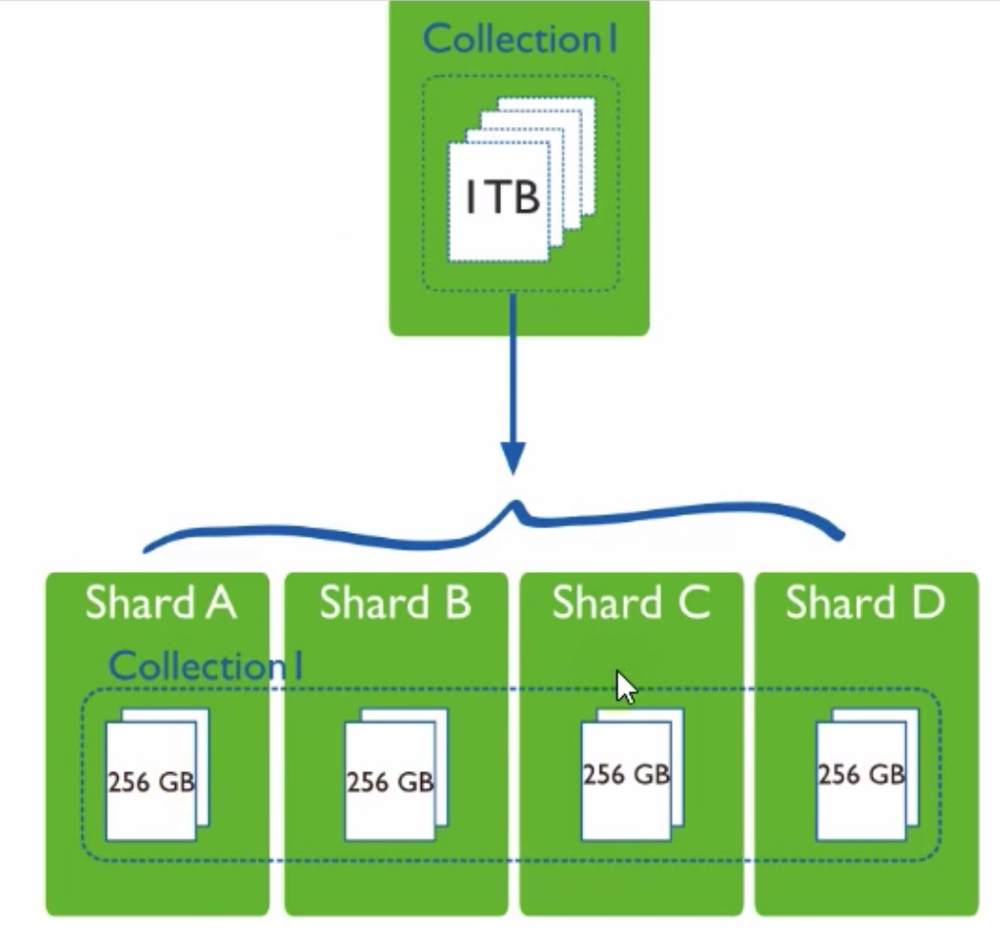

# chapter1   

mongodb is a document database
```
a document is a JSON content
```

```json
{
	song: 'xxx',
	artist: 'Tayler Swift'
}
```

in SQL databases, we save text content in structured tables

in mongoDB, we save structured JSON

Mongodb 
```sh
server -> db -> collections -> documents
```

SQL databases
```sh
server -> databases -> schema -> tables -> sql queries
```


MongoDB uses BSON [Binary form of JSON] to save data under the hood. Is this True?   true


MongoDB supports multiple storage engines:
```
WiredTiger Storage Engine (including support for Encryption at Rest)
In-Memory Storage Engine
MMAPv1 Storage Engine (Deprecated in MongoDB 4.0)
```
//////////////////////////////////////////////////////////////////////


7 things 

```
1 
a good client


2
_id field: auto-generated unique id as a document(json) identifier
ObjectId values consist of 12 bytes, where the first four bytes are a timestamp that reflect the ObjectId’s creation. Specifically:
a 4-byte value representing the seconds since the Unix epoch,
a 5-byte random value, and
a 3-byte counter, starting with a random value.


3 JSON & CRUD & SQL
3/7 learn about JSON+CRUD+SQLmapping

4 learn about the Manual 

5 aggregation
GridFS, Aggregation, REplication, Sharding
Aggregation pipeline

6 GridFS

7 the basic small things
Embedded documents or related documents

8 data modeling 

9 index

10 text search, transactions   

11 batch operation,  


```

interview questions


MongoDB Interview Questions
```sh
75. In aggregation pipeline What does $unwind does?
$unwind
Deconstructs an array field from the input documents to output a document for each element. Each output document is the input document with the value of the array field replaced by the element.

Consider an inventory with the following document:

{ "_id" : 1, "item" : "ABC1", sizes: [ "S", "M", "L"] }
The following aggregation uses the $unwind stage to output a document for each element in the sizes array:

db.inventory.aggregate( [ { $unwind : "$sizes" } ] )
The operation returns the following results:

{ "_id" : 1, "item" : "ABC1", "sizes" : "S" }
{ "_id" : 1, "item" : "ABC1", "sizes" : "M" }
{ "_id" : 1, "item" : "ABC1", "sizes" : "L" }

```

```
Overriding the _id example:
```
```sh
db.testSOF.insert({_id:"myUniqueValue", a:1, b:1})
```

```
another example of overriding the _id 
```

```
[   { "_id": 1, "language": "Java", "version": 8, "isJvmBased": "true" },
    { "_id": 2, "language": "Java", "version": 7, "isJvmBased": "true" },
    { "_id": 3, "language": "Groovy", "version": 3, "isJvmBased": "true" },
    { "_id": 4, "language": "Kotlin", "version": 2, "isJvmBased": "true" }
]


```


ObjectId.getTimestamp()
```
ObjectId.getTimestamp()
On this page

Example
ObjectId.getTimestamp()
Returns the timestamp portion of the ObjectId() as a Date.

Example
The following example calls the getTimestamp() method on an ObjectId():

ObjectId("507c7f79bcf86cd7994f6c0e").getTimestamp()
This will return the following output:

ISODate("2012-10-15T21:26:17Z")

```


```
Joins in Mysql can be done in Mongodb using embedded document and links. Is this True?    True

Many e-commerce applications use  hybrid architecture, a combination of MongoDB and MySQL . Is this True?  True

Compared to JSON, BSON is designed to be efficient both in storage space and scan-speed.Is this True?   True

JSON is built on Two Structures             true
1. Key Value Pairs like Object, HashTable
2. List Values like Array, Lector

MIME stands for "Multipurpose Internet Mail Extensions.
The MIME type for JSON text is “application/json”. Is this true?    true

In MongoDB
Each Server -> can have Multiple databases -> Each Database can have Multiple Collections -> Each collection can have multiple Documents.  true
```


mongoDB key features
```
Sharding-Horizontal Scaling
Replication
GridFS
Aggregation
capped collections


```

shard



```

server side javascript is supported. Javascript expression & function

Primary features of NOSQL database are Schemaless [No structure],Horizontally scalable [Auto Sharding]. Is this correct?  Yes

The cloud hosting of MongoDB which grants free tier of 512 MB for learning is called as Atlas     


76. In aggregation pipeline how will you output the resultant documents to a Collection?


set-1
1. How would you restrict the size of a collection in MongoDB?
2. What is meant by Covered Query in MongoDB?
3. How mongoDB can be used for Cache Management?
4. What is the difference between Enterprise and community version of MongoDB?
5. Have you worked with in premises or cloud hosting of MongoDB?
6. Have you used Atlas Service?
7. Why mongoDB?
8. What are the most powerful features of MongoDB?
9. How will you update all documents in a Collection?
10. How will add a field to all documents in a collection?
11. Have you used Stitch MongoDB Service?
12. What are the Best practices in MongoDB ?
13. How would you See the execution plan of a MongoDB Query?
14. Can MongoDB and Redis work together?
15. What's new in MongoDB 3.4?
16. Have you migrated your traditional Database to mongoDB ? Explain your experience?
17. Can you do document validation in a Collection? Explain
18. What are the validation levels in Mongodb?
19. Does MongoDB supports Views?
20. How to create views in MongoDB?
21. How would you relate documents in MongoDB?
22. Have you worked with Embedded documents in MongoDB? What's the advantage and
why do you used it?
23. What are Range and Key Value Queries?
24. Explain Aggregation in MongoDB? Why you selected it over Mapreduce?
25. What are Compound indexes ? When to use them?
26. How to do a ascending index in Mongodb?
27. How to use partialFilterExpression in MongoDB indexing?
28. How and When do you do reindexing?
29. What are Partial Indexes and Why they are used ?
30. If a field is present in all documents, What's the type of index you wil recommend?
[sparse index]
31. How do you index arrays?
32. What is your Project MongoDB Topology you used?\
33. What are the critical issues you faced when working with MongoDB?
34. Can you use MongoDB for Transaction ? Explain how will you ?
35. Does MongoDB supports Atomicity?
36. How you used javascript with MongoDB?
37. How does replication works in Mongodb? How election works?
38. What is the use of ismaster and freeze in replication?
39. Why we need Query Router?
40. What are the types of Sharding MongoDB Supports?
41. What's the advantage of hash Sharding?
42. What's the use of $lookup and $graphLookup?
43. Have you used MongoDB compose?
44. What's the GUI client you used and What are its frequently used features?
45. Have you worked with MongoDB on containers?
46. How MongoDB backup is done? Have you faced any issues?
47. How mongodb is monitored? Which software you used for that?
48. Have you ever rolled back to a previous database backup of MongoDB?
49. How can you lock a Database in MongoDB?
50. How to get the index details?
51. Which connection pooling you used in your code?
52. What is BSONdump?
53. How will you insert multiple documents in Mongodb?
54. How to do batch operations in Mongodb?
55. What is the difference between save and insert in MongoDB?
56. What is meant by write acknowledgement?
57. Whats is the replacement for SQL joins in MongoDB?
58. How to use regex in MongoDB? Give some examples?
59. What is soundex?
60. How to find distinct values in documents?
61. How to print all the users available in Mongodb?
62. What does show profile does?
63. How will you search a document with a String 'hello'?
64. Whats is the alternative for $in operator?
65. How do you do text search in mongoDB?
66. How will you search documents with array of Size 5?
67. What does $elemMatch does? explain with example
68. How will you check a Document , for a field's presence?
69. What does $unset does?
70. How will you get the current date in mongodb?
$currentDate
71. What does the difference between update and upsert?
72. How will you append a Value to an Array?
$push
73. What does $addtoset does?
74. What's the difference between $pull and $pullall?

77. How will you group documents in mongoDB?
78. Does MongoDB supports Encryption?
79. How do you store password and sensitive data in MongoDB?
80. How you migrated your data from sql databases to mongoDB?
81. What is the size limit of a MongoDB Document?
82. How Gridfs works? explain?
83. How will you upload images into mongodb? explain the architecture
84. What are the storage engines used by MongoDB?
85. What is the equivalent of Partitioning in Mongodb?
86. Explain Sharding in MongoDB ? List the steps
87. How will you add shards?
88. How to enable sharding in a Database?
89. Whats is Mongos?
90. What is Mongod process do?
91. Explain about objectid?
92. What are the alternatives to MongoDB?
93. Explain the stages in Aggregation pipeline?
94. Have you used any reporting or analytics tool with MongoDB?
95. What kind of ETL tool you used with mongoDB?
96. Explain your application architecture
97. How will you create a Database? and What are the considerations before creating a
database?
98. How will you create a Collection? and What are the considerations before creating a
database?
99. What is Vertical and Horizontal scaling?
100. What is $cmd?
101. What is the type of Authentication method you used?
102. What is BSON and What are the types of BSON?
103. Have you imported CSV content to Mongodb ?
104. What is meant by journaling?
105. Have you used server side javascript? and why it is not recommended?
106. What's the default data directory of MongoDB?
107. What are namespaces? What is the maximum length of Namespaces?

```