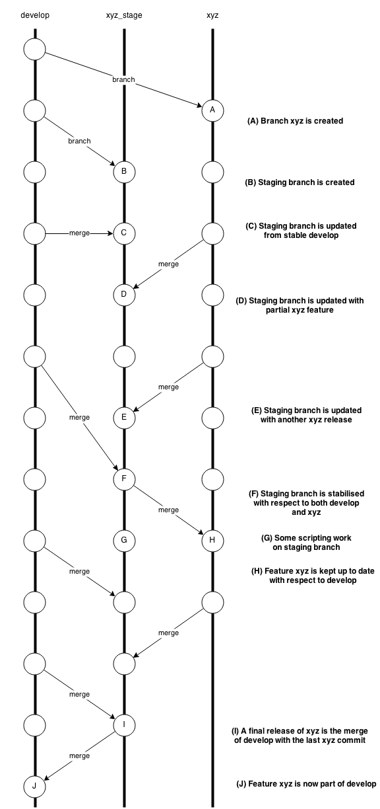

Git flow

https://www.atlassian.com/git/tutorials/comparing-workflows/gitflow-workflow


A complete example demonstrating a Feature Branch Flow is as follows. Assuming we have a repo setup with a master branch.

```
git checkout master
git checkout -b develop
git checkout -b feature_branch
# work happens on feature branch
git checkout develop
git merge feature_branch
git checkout master
git merge develop
git branch -d feature_branch
```


In addition to the feature and release flow, a hotfix example is as follows:

```
git checkout master
git checkout -b hotfix_branch
# work is done commits are added to the hotfix_branch
git checkout develop
git merge hotfix_branch
git checkout master
git merge hotfix_branch
```

uat
```
always push code to uat, but never pull code from uat(as some code is unnecessary and will be not published)

uat git flow

https://www.linkedin.com/pulse/git-flow-extended-qa-uat-balazs-hideghety/

```

Summary
Here we discussed the Gitflow Workflow. Gitflow is one of many styles of Git workflows you and your team can utilize.

Some key takeaways to know about Gitflow are:
```
The workflow is great for a release-based software workflow.
Gitflow offers a dedicated channel for hotfixes to production.
```

The overall flow of Gitflow is:
```
A develop branch is created from master
A release branch is created from develop
Feature branches are created from develop
When a feature is complete it is merged into the develop branch
When the release branch is done it is merged into develop and master
If an issue in master is detected a hotfix branch is created from master
Once the hotfix is complete it is merged to both develop and master
```

///////////////////////////////////// a few examples of constraints
```
1 rebase, don't merge / merge, don't rebase

2 only developer X can do Y on branch Z

3 Don't push to a red build(broken build = when a build is broken and cannot work)  

4 Squash a feature to a single commit before you merge it to a master
```
/////////////////////////////////////


-  `Master` 
This is a highly stable branch that is always production-ready and contains the last release version of source code in production.


-  `Develop` 
Derived from the master branch, the development branch serves as a branch for integrating different features planned for an upcoming release. This branch may or may not be as stable as the master branch. It is where developers collaborate and merge feature branches.


-  `Feature` 
This derives from the develop branch and is used to develop features.


-  `Release` 
This also derives from develop branch but is used during releases.


-  `Hotfix` 
This derives from the master branch and is used to fix a bug in the production branch that was identified after a release.


/////////////////////////////////////featureAndStageBranch      

Only you understand how the code on develop and feature/xyz aligns, no one else. It is only you who can merge the two flows correctly in a discerning way. Even with the default merging strategies, which are far less dangerous than -S ours or -X theirs you still always have to review the result.

You may need some help of course, and git will offer some. For example, you can use git recorded resolutions - rerere to help with making the same correct merge decision after you made one initially.

A fairly common, and relatively simple model, using the names you’ve supplied for the branches, could work for you like this,

**develop** is the branch where the main thrust of development occurs

**xyz** is the branch where you develop the feature xyz

**xyz_stage** is the branch where you merge the develop and the xyz code, keeping that branch stable in line with the respective stable points of develop and xyz. This is also the branch that you’d eventually merge back into develop when you are ready to release feature xyz or part of thereof.


The above assumes that not only you merge xyz into xyz_stage but that you also merge develop into xyz_stage from time to time and make sure that the portions of xyz so far released to xyz_stage work and pass the relevant tests in conjunction with the code from develop.

Nevertheless, you still have to choose how do you make the xyz branch, where you work on the feature, aware of the progress on develop.

The cleanest option is - don’t make it aware. That’s why you have xyz_stage where the two development flows come together. This approach is feasible and sane as long as the development of xyz is not prolonged.

The second option is to merge xyz_stage back into xyz when you are happy with the staging branch. That way you will have stable point that you can continue and develop the xyz feature on top.

Here's a simple illustration of the process, with comments:





/////////////////////////////////////
git flow release


init
```
~/Desktop/chat_pics/AceEdustation/program/aceedustation/aes1-new [develop] $ git flow init

Which branch should be used for bringing forth production releases?
   - develop
   - leon
   - master
Branch name for production releases: [master] master

Which branch should be used for integration of the "next release"?
   - develop
   - leon
Branch name for "next release" development: [develop] develop

How to name your supporting branch prefixes?
Feature branches? [feature/] 
Release branches? [release/] 
Hotfix branches? [hotfix/] 
Support branches? [support/] 
Version tag prefix? [] 

```

release flow
```

# on develop branch   
git flow release start 0.1.0  

git flow release publish 0.1.0    # then we can see this branch on remote(like bitbucket, github)

git flow release finish 0.1.0     # then the release branch is merge to master, and we are switched to master branch

git push                          # then push the master to remote

```


/////////////////////////////////////
git flow hotfix 

The process is almost identical to the release process although **the hotfix branch is created from the master branch** to reflect a change to the last release.

```
# on dev branch
git pull
git checkout master
# on master branch
git pull
git flow hotfix start v0.1.1

Summary of actions:
- A new branch 'hotfix/v0.1.1' was created, based on 'master'
- You are now on branch 'hotfix/v0.1.1'

echo 'v0.1.1' > version.txt  # or other hotfix operations
git add -A
git commit -m "updated version file to v0.1.1; completed hotfix"   
git flow hotfix finish -m 'v0.1.1' v0.1.1   # the changes will automatically be merged to master and develop 
# finally, we are on develop branch
git push    # push the changes to remote(push the develop and master to remote)
```

/////////////////////////////////////
git flow tools

https://blog.axosoft.com/gitflow/

https://gist.github.com/JamesMGreene/cdd0ac49f90c987e45ac

https://www.atlassian.com/git/tutorials/comparing-workflows/gitflow-workflow


mac install git flow
```
brew install git-flow
```

```
$ git flow
usage: git flow <subcommand>

Available subcommands are:
   init      Initialize a new git repo with support for the branching model.
   feature   Manage your feature branches.
   release   Manage your release branches.
   hotfix    Manage your hotfix branches.
   support   Manage your support branches.
   version   Shows version information.
```


