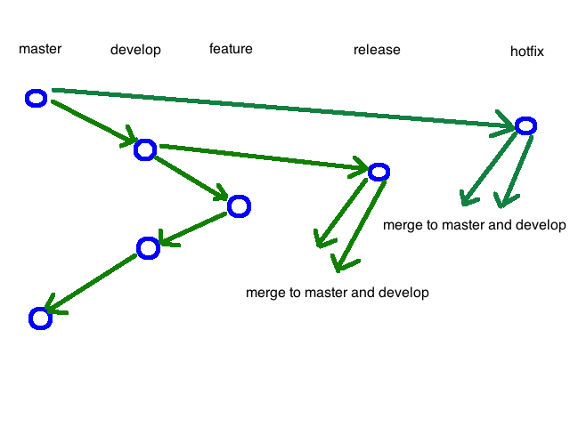

git branch   

# branch setup    

```
1 develop     // for develop  
2 release     // for release    
3 hotfix      // for emergent fix in production environment    
4 feature     // for developing features      
```

# git branch example1 - normal development process   
```
1 create a local feature branch(call localFeature), use this branch to modify code and commit changes locally  

2 switch to develop branch, 

pull remote code

as other colleagues may have changed the code

3 switch back to localFeature branch

$> git rebase develop

so that the commitment in localFeature branch will be placed in the front of develop branch

4 switch back to develop branch, 

$> git merge localFeature

so that we merge the commitment from localFeature to develop branch  

5 push code in local develop branch to remote repo 

```


# git branch example2 - simple example of push a localBranch to a new remote branch   
```
1 commit local branch(say the local branch is call localBranch)

2 create a local branch called newRemoteBranch and switch to that branch 

$> git checkout -b newRemoteBranch


3 push the local content to remote, and use the branch call newRemoteBranch

$> git push origin newRemoteBranch

```


Pull requests
```
Pull requests let you tell others about changes you've pushed to a GitHub repository. Once a pull request is sent, interested parties can review the set of changes, discuss potential modifications, and even push follow-up commits if necessary.
```

Pushing to a remote
```
Use git push to push commits made on your local branch to a remote repository.

The git push command takes two arguments:

A remote name, for example, origin
A branch name, for example, master
```

# git stash    


```
git add -A
git stash            // save all the tracks in a stash
...
git stash pop        // apply the stash to current branch, and the stash is gone
git stash apply      // apply the stash to current branch, and the stash can be resued for other branch  

```

# delete a branch   

delete a remote branch using
```
$> git push <remote_name> --delete <branch_name>
Like $> git push origin --delete <branch_name>
```

To delete the local branch :
```
$> git branch -d branch_name

or
$ git branch -D branch_name

```

# Rollback to an old Git commit in a public repo


```
git checkout [revision] .
```
where [revision] is the commit hash (for example: 12345678901234567890123456789012345678ab).

Don't forget the . at the end, very important. This will apply changes to the whole tree. Then commit and you should be good.

You can undo this by
```
git reset --hard; 
```
that will delete all modifications from the working directory and staging area.


# git fetch, git pull, git rebase   


# Revert changes to modified files.
```
git reset --hard
```

or
```
//First get the commit ID
git log
or
git log --oneline

//then use the following cmd to revert into the a commit ID
git revert commit-id
```

# typical git flow   


# git flow FeatureDevReleaseHotfixMaster  


