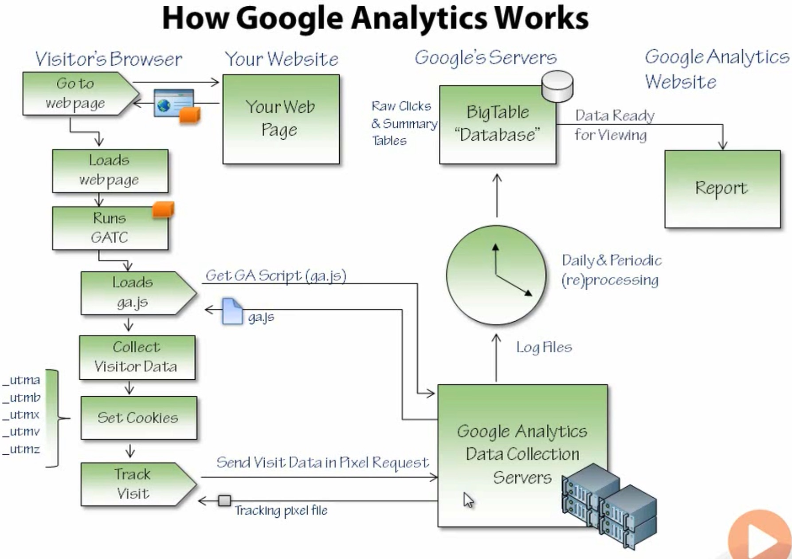

# basics

## introducing Google Analytics  

### overview

1 tracking visits and visitor activity  
2 tracking more specialized forms of engagement  
3 managing reports and data  
4 programming Google Analytics  

### what can web analytics tell you?  

```
Tell you who your visitors are
 how often they visit
 how people are finding your site
 where geographically they are coming from
 when they are visiting

Tell you what your visitors like(or dislike)
 how long they spend on your site
 what pages are interesting, which pages turn them off
 give you details on specific in-page interactions

Tell you about your social media love
 how many liks or tweets you site is getting 

```

### Why use Google Analytics for Web Analytics?   

```
Server Log based tracking
 Captures visitors to your  

Page View based tracking(This is the approach taken by Google Analytics)
 Uses a beacon that transmits tracking data to centralized servers(separate from your web server) when a visitor visits your site and interacts with its contents
 requires JavaScript on the visitor's browswer & changes to web pages
 Completely offloads the website owner from managing, collecting and processing server log files

```  

In the end Google Analytics makes it easy to collect and analyze website activity data

### How Google Analytcis Works     

```
visitor's Browser<------->Your website         Google's service---------Google Analytics Website
      |                                               |
      |                                               |
      |                                             Daily&Periodic(re) processing Log files
    ga.js                                             |
      |                                               |
      |                                               |
      -------------------------------------Google Analytics Data Collection Servers

```



### the sample webpage   
Free Trial Landing page -> checkout page -> thank you page

other pages:    
```
Home 
About us
Contact Us
Download
Whitepapers

```

### enabling Analytics     

GATC/gætʃu/ Google Analytics Tracking Code

```
www.google.com/analytics

start using google analytics

enter the website that you want to track

then we can see the google analytics tracking code(just copy that code to all of your web pages- right before the head GATC of every webpage of our website)
```

```html
<head>
    <meta charset="utf-8" />
    ...

    <script type="text/javascript">     //GATC code 
       var _gaq = _gaq || [];

    </script>

</head>
```

then we can see all the analytics data in google analytics admin page, including Dashboard, ...


